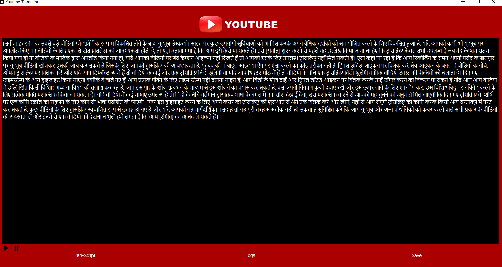
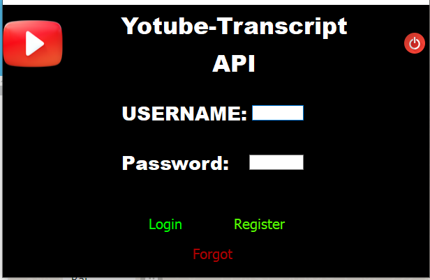
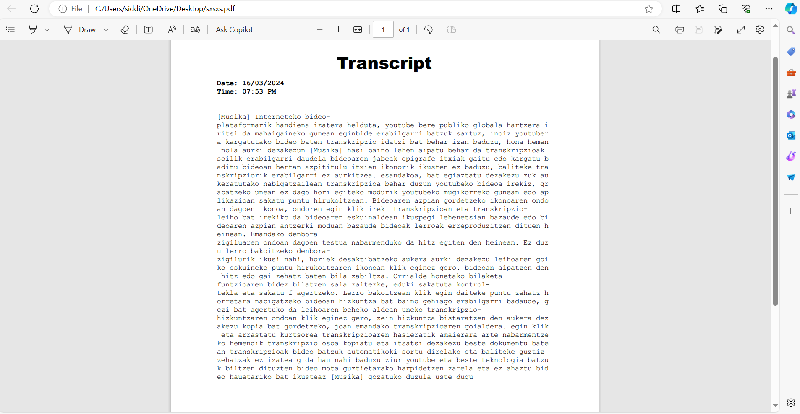
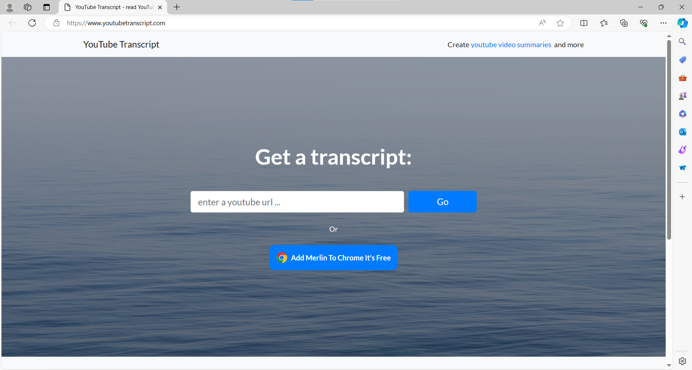

# Youtube Transcript

YouTube transcript is a Qt-based C++ application designed for transcribing, summarizing, and listing YouTube video content in multiple languages.

## Badges

Add badges from somewhere like: [shields.io](https://shields.io/)

## Authors

- [@Shoeb_siddiki ](https://www.github.com/shoeb-siddiqui)

## Features

- Summzrize
- Translate 
- Text to speak
- Transcript
- Pdf

## Screenshots
### Homepage

### Loginpage

### Pdfsheet

### Gettingtranscript

## feel free to ask question here Siddiquishoeb7000@gmail.com

## Feedback

If you have any feedback, please reach out to us at Siddiquishoeb7000@gmail.com
